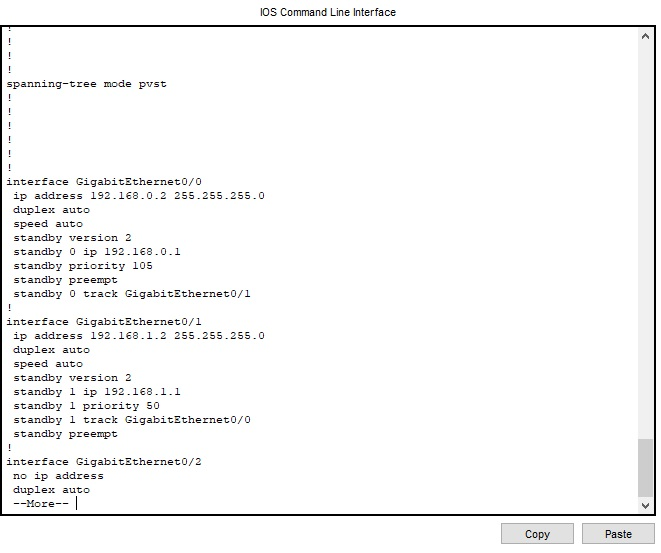
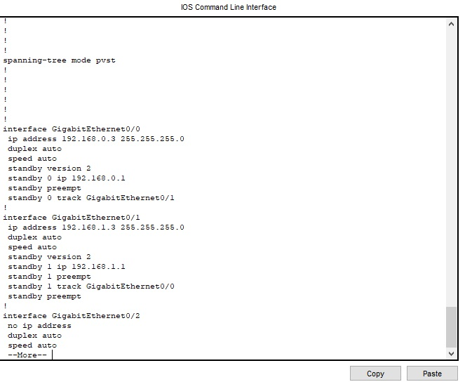
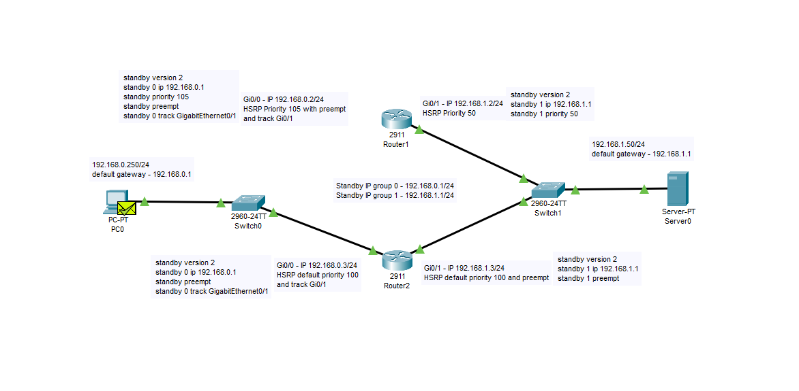
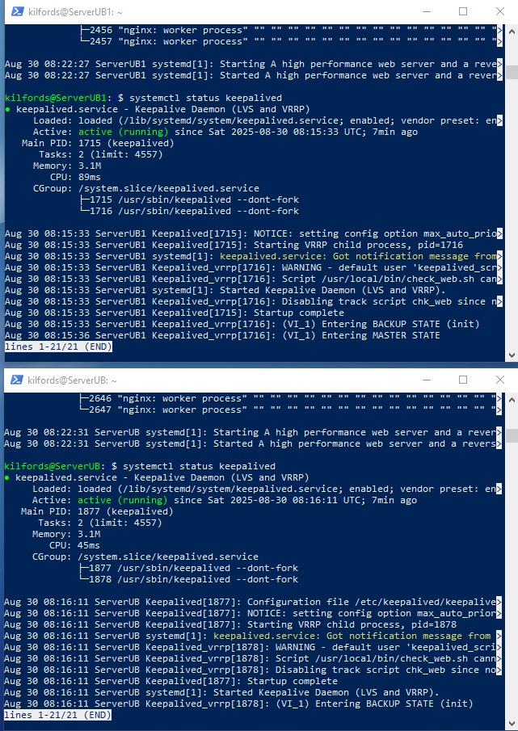
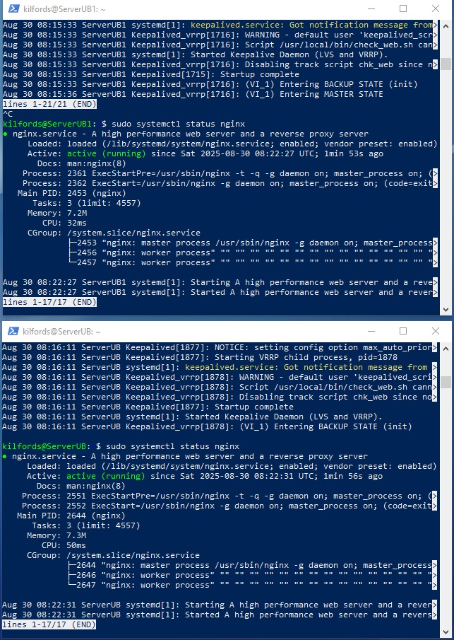
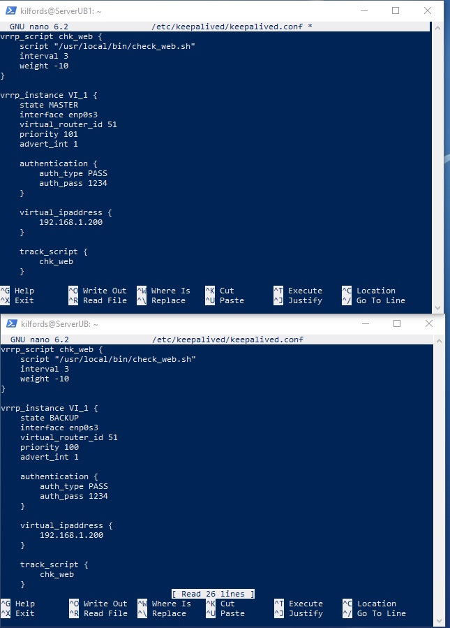
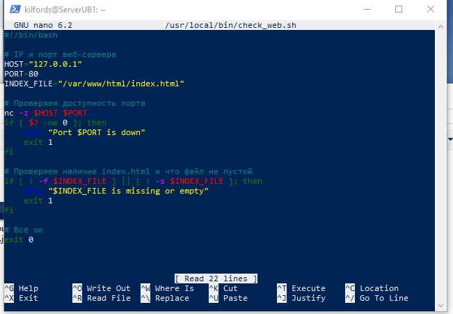

Домашнее задание к занятию "Zabbix TWO DZ" - Боковиков Илья студента
Инструкция по выполнению домашнего задания

    Сделайте fork данного репозитория к себе в Github и переименуйте его по названию или номеру занятия, например, https://github.com/имя-вашего-репозитория/git-hw или https://github.com/имя-вашего-репозитория/7-1-ansible-hw).
    Выполните клонирование данного репозитория к себе на ПК с помощью команды git clone.
    Выполните домашнее задание и заполните у себя локально этот файл README.md:
        впишите вверху название занятия и вашу фамилию и имя
        в каждом задании добавьте решение в требуемом виде (текст/код/скриншоты/ссылка)
        для корректного добавления скриншотов воспользуйтесь инструкцией "Как вставить скриншот в шаблон с решением
        при оформлении используйте возможности языка разметки md (коротко об этом можно посмотреть в инструкции по MarkDown)
    После завершения работы над домашним заданием сделайте коммит (git commit -m "comment") и отправьте его на Github (git push origin);
    Для проверки домашнего задания преподавателем в личном кабинете прикрепите и отправьте ссылку на решение в виде md-файла в вашем Github.
    Любые вопросы по выполнению заданий спрашивайте в чате учебной группы и/или в разделе “Вопросы по заданию” в личном кабинете.

Задание 1

    Дана схема для Cisco Packet Tracer, рассматриваемая в лекции.
    На данной схеме уже настроено отслеживание интерфейсов маршрутизаторов Gi0/1 (для нулевой группы)
    Необходимо аналогично настроить отслеживание состояния интерфейсов Gi0/0 (для первой группы).
    Для проверки корректности настройки, разорвите один из кабелей между одним из маршрутизаторов и Switch0 и запустите ping между PC0 и Server0.
    На проверку отправьте получившуюся схему в формате pkt и скриншот, где виден процесс настройки маршрутизатора.

Задание 2

    Запустите две виртуальные машины Linux, установите и настройте сервис Keepalived как в лекции, используя пример конфигурационного файла.
    Настройте любой веб-сервер (например, nginx или simple python server) на двух виртуальных машинах
    Напишите Bash-скрипт, который будет проверять доступность порта данного веб-сервера и существование файла index.html в root-директории данного веб-сервера.
    Настройте Keepalived так, чтобы он запускал данный скрипт каждые 3 секунды и переносил виртуальный IP на другой сервер, если bash-скрипт завершался с кодом, отличным от нуля (то есть порт веб-сервера был недоступен или отсутствовал index.html). Используйте для этого секцию vrrp_script
    На проверку отправьте получившейся bash-скрипт и конфигурационный файл keepalived, а также скриншот с демонстрацией переезда плавающего ip на другой сервер в случае недоступности порта или файла index.html

