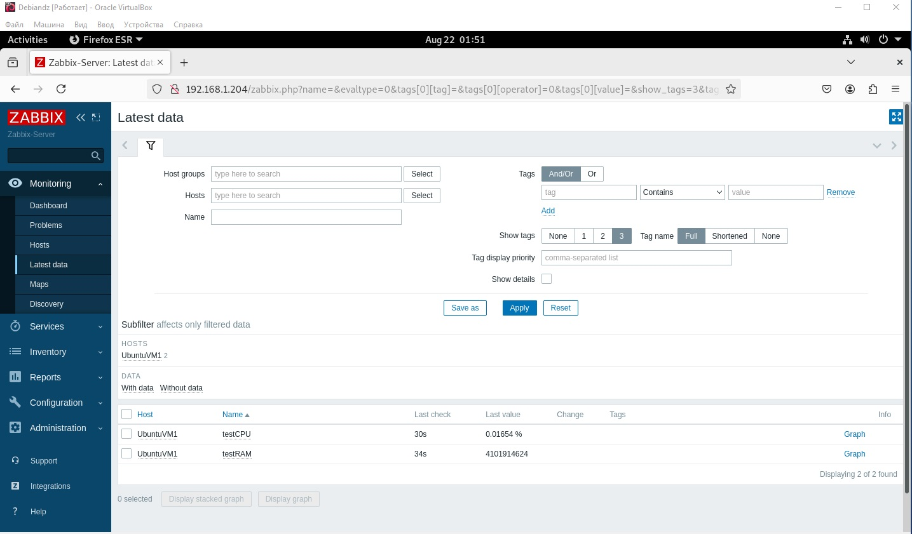
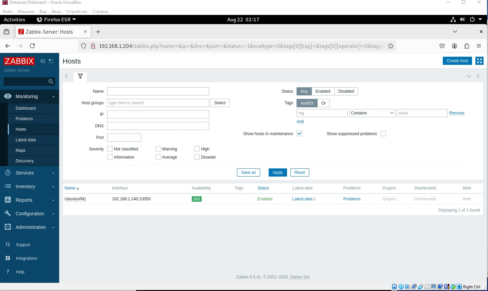
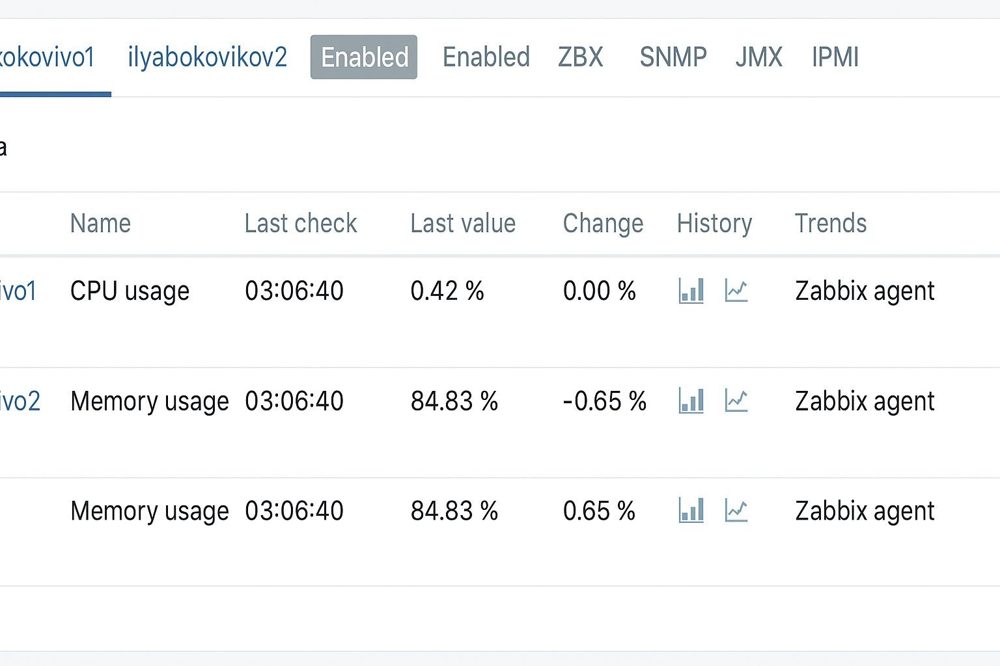
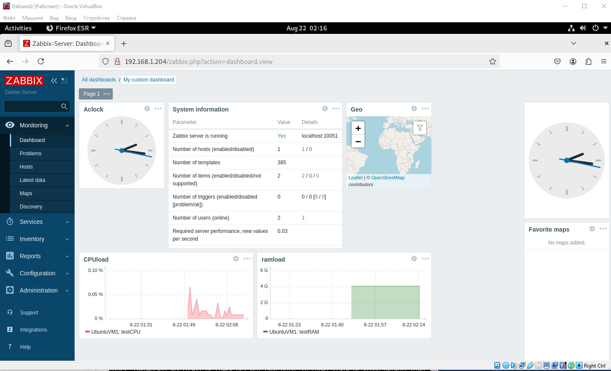

Домашнее задание к занятию "Zabbix TWO DZ" - Боковиков Илья студента
Инструкция по выполнению домашнего задания

    Сделайте fork данного репозитория к себе в Github и переименуйте его по названию или номеру занятия, например, https://github.com/имя-вашего-репозитория/git-hw или https://github.com/имя-вашего-репозитория/7-1-ansible-hw).
    Выполните клонирование данного репозитория к себе на ПК с помощью команды git clone.
    Выполните домашнее задание и заполните у себя локально этот файл README.md:
        впишите вверху название занятия и вашу фамилию и имя
        в каждом задании добавьте решение в требуемом виде (текст/код/скриншоты/ссылка)
        для корректного добавления скриншотов воспользуйтесь инструкцией "Как вставить скриншот в шаблон с решением
        при оформлении используйте возможности языка разметки md (коротко об этом можно посмотреть в инструкции по MarkDown)
    После завершения работы над домашним заданием сделайте коммит (git commit -m "comment") и отправьте его на Github (git push origin);
    Для проверки домашнего задания преподавателем в личном кабинете прикрепите и отправьте ссылку на решение в виде md-файла в вашем Github.
    Любые вопросы по выполнению заданий спрашивайте в чате учебной группы и/или в разделе “Вопросы по заданию” в личном кабинете.

Задание 1

Создайте свой шаблон, в котором будут элементы данных, мониторящие загрузку CPU и RAM хоста.
Процесс выполнения

    Выполняя ДЗ сверяйтесь с процессом отражённым в записи лекции.
    В веб-интерфейсе Zabbix Servera в разделе Templates создайте новый шаблон
    Создайте Item который будет собирать информацию об загрузке CPU в процентах
    Создайте Item который будет собирать информацию об загрузке RAM в процентах

Задание 2

Добавьте в Zabbix два хоста и задайте им имена <фамилия и инициалы-1> и <фамилия и инициалы-2>. Например: ivanovii-1 и ivanovii-2.
Процесс выполнения

    Выполняя ДЗ сверяйтесь с процессом отражённым в записи лекции.
    Установите Zabbix Agent на 2 виртмашины, одной из них может быть ваш Zabbix Server
    Добавьте Zabbix Server в список разрешенных серверов ваших Zabbix Agentов
    Добавьте Zabbix Agentов в раздел Configuration > Hosts вашего Zabbix Servera
    Прикрепите за каждым хостом шаблон Linux by Zabbix Agent
    Проверьте что в разделе Latest Data начали появляться данные с добавленных агентов

Требования к результату

    Результат данного задания сдавайте вместе с заданием 3

Задание 3

Привяжите созданный шаблон к двум хостам. Также привяжите к обоим хостам шаблон Linux by Zabbix Agent.
Процесс выполнения

    Выполняя ДЗ сверяйтесь с процессом отражённым в записи лекции.
    Зайдите в настройки каждого хоста и в разделе Templates прикрепите к этому хосту ваш шаблон
    Так же к каждому хосту привяжите шаблон Linux by Zabbix Agent
    Проверьте что в раздел Latest Data начали поступать необходимые данные из вашего шаблона

Задание 4

Создайте свой кастомный дашборд.
Процесс выполнения

    Выполняя ДЗ сверяйтесь с процессом отражённым в записи лекции.
    В разделе Dashboards создайте новый дашборд
    Разместите на нём несколько графиков на ваше усмотрение.
