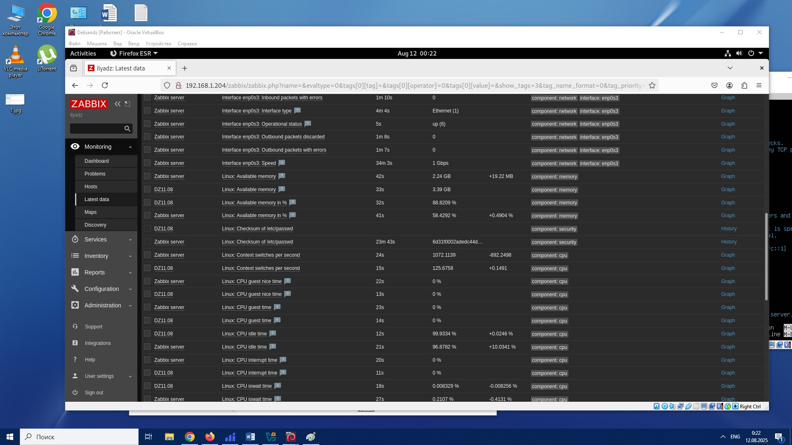

# Домашнее задание к занятию "`Название занятия`" - `Боковиков Илья`


### Инструкция по выполнению домашнего задания

   1. Сделайте `fork` данного репозитория к себе в Github и переименуйте его по названию или номеру занятия, например, https://github.com/имя-вашего-репозитория/git-hw или  https://github.com/имя-вашего-репозитория/7-1-ansible-hw).
   2. Выполните клонирование данного репозитория к себе на ПК с помощью команды `git clone`.
   3. Выполните домашнее задание и заполните у себя локально этот файл README.md:
      - впишите вверху название занятия и вашу фамилию и имя
      - в каждом задании добавьте решение в требуемом виде (текст/код/скриншоты/ссылка)
      - для корректного добавления скриншотов воспользуйтесь [инструкцией "Как вставить скриншот в шаблон с решением](https://github.com/netology-code/sys-pattern-homework/blob/main/screen-instruction.md)
      - при оформлении используйте возможности языка разметки md (коротко об этом можно посмотреть в [инструкции  по MarkDown](https://github.com/netology-code/sys-pattern-homework/blob/main/md-instruction.md))
   4. После завершения работы над домашним заданием сделайте коммит (`git commit -m "comment"`) и отправьте его на Github (`git push origin`);
   5. Для проверки домашнего задания преподавателем в личном кабинете прикрепите и отправьте ссылку на решение в виде md-файла в вашем Github.
   6. Любые вопросы по выполнению заданий спрашивайте в чате учебной группы и/или в разделе “Вопросы по заданию” в личном кабинете.
   
Желаем успехов в выполнении домашнего задания!
   
### Дополнительные материалы, которые могут быть полезны для выполнения задания

1. [Руководство по оформлению Markdown файлов](https://gist.github.com/Jekins/2bf2d0638163f1294637#Code)

---

### Задание 1


```
Поле для вставки кода...
sudo apt update
sudo apt install -y postgresql postgresql-contrib
sudo systemctl start postgresql
<!-- sudo systemctl enable postgresql -->
sudo systemctl status postgresql
sudo apt install -y apache2
sudo systemctl start apache2
sudo systemctl enable apache2
sudo systemctl status apache2
wget https://repo.zabbix.com/zabbix/6.4/debian/pool/main/z/zabbix-release/zabbix-release_6.4-1+debian11_all.deb
sudo dpkg -i zabbix-release_6.4-1+debian11_all.deb
sudo apt update
sudo apt install -y zabbix-server-pgsql zabbix-frontend-php zabbix-apache-conf zabbix-sql-scripts zabbix-agent
sudo -u postgres psql
zcat /usr/share/doc/zabbix-sql-scripts/postgresql/create.sql.gz | psql -U zabbix -d zabbix
sudo nano /etc/zabbix/zabbix_server.conf
DBName=zabbix
DBUser=zabbix
DBPassword=пароль_тут
sudo systemctl restart zabbix-server zabbix-agent apache2
sudo systemctl enable zabbix-server zabbix-agent apache2


### Задание 2



Так же все картинки имеются в папке img
Список команд для выполнения 2 дз 
wget https://repo.zabbix.com/zabbix/6.4/debian/pool/main/z/zabbix-release/zabbix-release_6.4-1+debian11_all.deb
sudo dpkg -i zabbix-release_6.4-1+debian11_all.deb
sudo apt update
sudo apt install -y zabbix-agent
sudo systemctl start zabbix-agent
sudo systemctl enable zabbix-agent
sudo systemctl status zabbix-agent
sudo nano /etc/zabbix/zabbix_agentd.conf
Server=<IP_сервера_Zabbix>
Hostname=<имя_агента_в_интерфейсе_Zabbix>
sudo systemctl restart zabbix-agent
