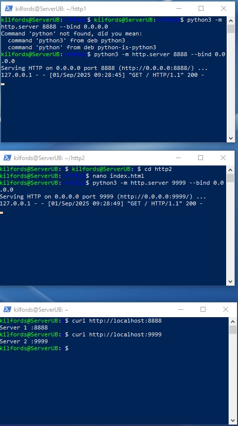

Домашнее задание к занятию "Zabbix TWO DZ" - Боковиков Илья студента
Инструкция по выполнению домашнего задания

    Сделайте fork данного репозитория к себе в Github и переименуйте его по названию или номеру занятия, например, https://github.com/имя-вашего-репозитория/git-hw или https://github.com/имя-вашего-репозитория/7-1-ansible-hw).
    Выполните клонирование данного репозитория к себе на ПК с помощью команды git clone.
    Выполните домашнее задание и заполните у себя локально этот файл README.md:
        впишите вверху название занятия и вашу фамилию и имя
        в каждом задании добавьте решение в требуемом виде (текст/код/скриншоты/ссылка)
        для корректного добавления скриншотов воспользуйтесь инструкцией "Как вставить скриншот в шаблон с решением
        при оформлении используйте возможности языка разметки md (коротко об этом можно посмотреть в инструкции по MarkDown)
    После завершения работы над домашним заданием сделайте коммит (git commit -m "comment") и отправьте его на Github (git push origin);
    Для проверки домашнего задания преподавателем в личном кабинете прикрепите и отправьте ссылку на решение в виде md-файла в вашем Github.
    Любые вопросы по выполнению заданий спрашивайте в чате учебной группы и/или в разделе “Вопросы по заданию” в личном кабинете.

Задание 1

    Запустите два simple python сервера на своей виртуальной машине на разных портах
    Установите и настройте HAProxy, воспользуйтесь материалами к лекции по ссылке
    Настройте балансировку Round-robin на 4 уровне.
    На проверку направьте конфигурационный файл haproxy, скриншоты, где видно перенаправление запросов на разные серверы при обращении к HAProxy.
Дальше будут скрины относящиеся к 1 ДЗ 

Задание 2

    Запустите три simple python сервера на своей виртуальной машине на разных портах
    Настройте балансировку Weighted Round Robin на 7 уровне, чтобы первый сервер имел вес 2, второй - 3, а третий - 4
    HAproxy должен балансировать только тот http-трафик, который адресован домену example.local
    На проверку направьте конфигурационный файл haproxy, скриншоты, где видно перенаправление запросов на разные серверы при обращении к HAProxy c использованием домена example.local и без него.
Далее я запуска ещё один python server, на скрине где stats будет видно!

Так же прилагаю рар архив с файлом haproxy ко второму заданию! [Архив с haproxy!](https://drive.google.com/file/d/1gSI1KWbVRbEzsQT-1D_Vnuw1RBFF-1VN/view?usp=sharing)